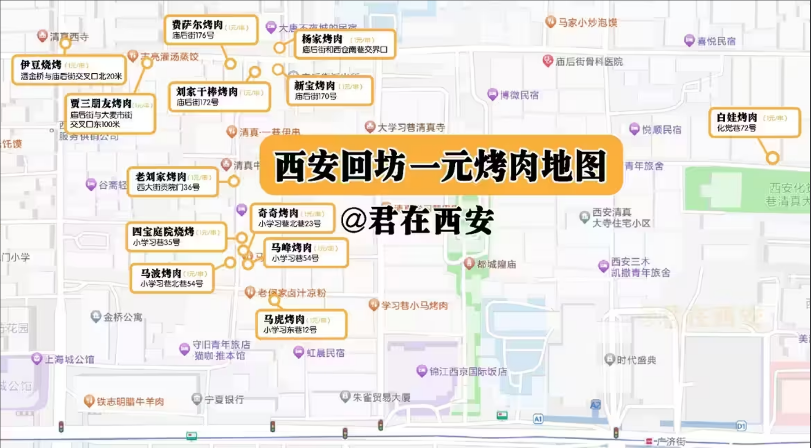
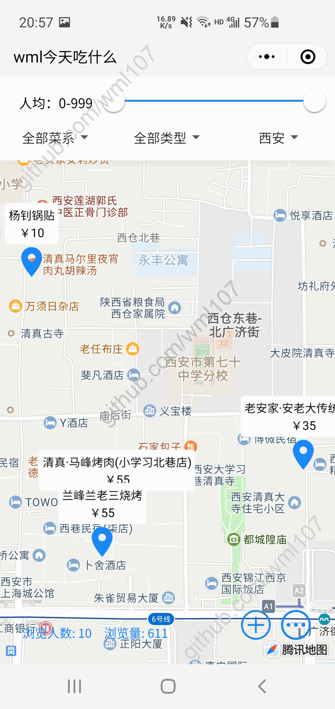
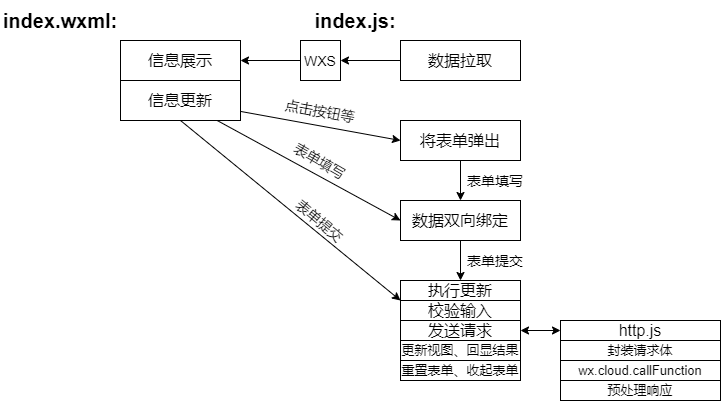

# 美食地图

这是一个前后端均基于微信小程序生态，用于记录你吃吃喝喝、以地图标记的形式可视化分享生活点滴的Web应用。

## 起因

读大学期间，经常想自己、和同学，出去吃点什么好吃的，但因为并非西安本地人，不知道吃点什么，所以就在网上搜，看大众点评、小红书、b站up主。

每次看到一家觉得不错的店，由于行程的缘故，总要去在线地图搜索这家店，去看这家店是否契合自己的行程——和自己要去的几个地方离得远不远、是否顺路、做地铁放不方便；

这是一方面，另一方面，还经常在纠结到底要吃什么品类；

或者是要在西安待两天的话(学校在郊区)，想多吃几家，纠结怎么搭配这些店规划路线；

---

然后我还是一个分享欲旺盛的人，每次总想要记录一下，存相册只是简单的堆积况且以后也大概率不会再翻，发空间或朋友圈又有点太频繁，显得鸡毛蒜皮。我希望有一个应用，能够以吃这件事儿，直观可视地标记自己过去走过的岁月，同时也方便为我身边的人安利我去过的这些店。

---

直到我看到了一位叫“君在西安”的up，有段时间他在b站集中的分享他在小学习巷吃的各种好吃的烧烤，网友们也想去，总是问他店名。后来有位网友做了个图片汇总，他把那一片所有比较好吃的烧烤，都在地图上，做了各种标注，看起来非常直观。



这给了我很大的启发：用地图标记自己去过的店，再附上一些描述，这是个很不错的解决我上面那些问题的方法。

## 哎

我产生这个想法的时候，还以为自己想出的是一个全新的点子，后来应用写到一半，去微信搜了一下，发现这个题材已经要被做烂了。但既然已经做的差不多了，还是决定把它做出来。

ps：时隔两个月后我又再次意识到这是个普通的不能再普通的点子，这种聚合信息的形式，已经有很多产品在使用了，例如大众点评的地图模式、华住会的地图找酒店、房产中介的地图找房。

但事后做完了再看，我自认为，我做的这个东西，还是比那些类似产品强很多的，并且也有它们不具备的独到之处。所以总算是没白做，这个东西还是有意义的。

## 我希望实现一个这样的应用

能够标记自己去过的店：应用的核心是一张地图，进入应用选定城市之后，搜索店名获取这个店的位置，然后添加一条打卡，附有自己拍的图片、就餐体验、价位描述、时间以及其他什么想说的话。添加完成之后，再看这张地图，就会产生一个标记，点击这个标记就可以显示相关的信息，还可以直接进入导航规划路线。

能筛选：可以根据菜系、价位之类的筛选地图上的标记。

单一发布者：这个应用我并不想引入交互，仅是单纯的由单纯的应用部署者发布自己的吃喝经历，然后其他用户进入平台仅是浏览。不打算做成那种有一个用户系统，然后每个人可以注册一个账号发布自己的内容且在这个平台浏览别人内容的形式。原因有四：

1. 这只是个小型应用，自己生活的点点滴滴被托管在别人开设的平台且自己无权管理这些资源，我觉得很别扭。
2. 这也引申出了第二点，我自己在这个应用的开发中，作为非盈利的个人开发者的身份，没有能力去维护一个这样的多用户平台，去保管别人的数据，所以干脆由大家自己去部署。
3. 做成这种多用户的平台，很可能最后也会出现一堆平台，然后每个平台都有一批用户，不同平台内容互相隔离，那还不如一开始就做成单源发布的。
4. 麻烦，做成这样有点背离我的初衷。

浏览量统计：统计有多少人使用过应用，有多少总浏览量。

公告：用于向浏览你内容的用户发布一些额外补充信息。

## 应用的初步分析以及技术选型

这个应用只有我(应用的管理者)，涉及内容的发布，也就是写操作；其他人均作为浏览者，平台的所有用户，在这个系统中基本上只涉及读。所以这个应用相对来说比较简单，没有过多的性能要求、没有并发要求，可以轻松达到用户流畅使用系统这一目的。

利用这个应用发布各种内容，除了给自己看，也会给别人看，所以最好客户端用起来方便一些，那就排除了那种独立应用，浏览器的话，国内用的有点少，所以我选择以微信小程序的方式实现这个应用。当然，这也有一点我的私心，我最近刚学了怎么写小程序、然后也想体验一下云开发，并且以前没涉足过这块，希望丰富一下自己的作品集。

客户端选用了微信小程序的话，服务端方面我就顺理成章的选择了微信云函数。原因有三：

1. 和小程序配合的好，这主要体现在三方面：
   - 鉴权。因为这都是微信自家的产品，内部是打通的，鉴权极其简单，前端不需要做任何事，服务端也仅是一行代码就能核实身份；
   - 请求参数校验。云函数和小程序通信走的是内部协议，这就使得客户端请求变得极其可控，云函数接收到的所有请求一定都是从小程序这个客户端传过来的，这就又解决了参数校验问题。
   - 数据库和文件库。这两个东西云函数自带，直接解决了往哪儿存数据、图片的问题，导出也十分方便。
2. 应用本身比较简单，用这一套东西来开发确实是比较方便快捷。整个应用都是由腾讯来帮你托管，所以部署也好、对非法请求的过滤也好，这些东西完全都不用考虑了，只需要去做功能开发。
3. 毕竟这个应用做出来我是想开源也让别人用的，我希望尽可能地方便大家部署，搞个什么Node.js或者SpringBoot让人家去搞服务器、配环境，实在是太麻烦了，不是谁都有这个条件的，但云函数就有手就行。

>但事后证明，这套东西倒也有他的弊端：
>
>- 小程序提供的map组件难用的要死，文档根本就没说清楚，他们自己的社区一堆提问的官方也不给回复。首先是地图中标记的自定义label用不了，照着文档里写了但不生效；自定义callout也用不了，样式根本没办法生效；点聚合这个特性也是难用的很，文档根本没说清楚，最后我是靠猜的才把这里弄好（，但你去网上搜相关的问题还是能看到一堆人这个问题得不到解决，网上根本搜不到解决办法），他这个地图组件里标记的聚合功能是怎么用的我这里就不展开了，有机会单开一帖。
>- 云函数操作数据库时，利用聚合函数进行分组查询查询不了，报错。当时是查询marker表，这个表里每个记录都有city字段，我希望从中提取所有种类的city值，利用了他给的`aggregate().group()`这个方法，报错，那个错误码简直是莫名其妙，你从报错信息看是啥也看不出来的。搜索不到解决办法，去他们社区提问也至今没回复。
>- 官方文档写的很乱，一个东西的用法，这里写一点，那里写一点，要到处找，还有一部分找不到的，你去搜索会发现社区有官方人员给解答回复，那既然这样为啥不更新补充到文档里呢？
>- 加载显示微信云存储里的图片的时候，只能把他的那个链接指定在image元素的src属性里，没办法指定成背景。你要想指定成背景或者根据别的什么途径获得这个图片，你还得再拿着这个链接(他们叫FileID)去请求真正的链接，然后这个链接还有有效期，光一来一回请求这个临时链接就得花去一部分时间，对于显示图片这种场景显然是不可取的。
>- 不允许你把图片的背景指定为本地地址或者云存储的FileID，要想这样做就只能用WXML提供的\<image>标签，但这东西一点也不好用，没法指定宽高，不管你怎么指定宽高最终都是失效的，最终就是图片以各种你不想看到的方式显示。
>- 缺少好用的UI库，导致很多UI层面的东西需要你自己去写。Vant并没有预想中的好用，存在一系列问题，包括并不限于：json引入的时候绝大多数组件在页面级json引入都是无效的，需要全局引入；样式设置极其不便，你想在他这个东西的基础上改一下样式极其不方便，尤其是在他组件样式一开始就出错的时候，你想改都没法改；输入框只要长度不是750rpx占满全屏宽度就会出错；滑块不支持区间选择；文件上传要么就是发送到指定地址，要么就是直接传到云存储了，没办法通过调用云函数实现；下拉菜单的选项列表要求指定名称的属性，绝大多数情况你的选项列表里的属性根本就不是text和value，所以为了用你还得再用WXS写一个计算属性；更多的还是各种你把这些组件装入一些父容器后的样式错乱。
>- 每个云函数都是隔离的，我是直接把几类请求（也就是路径的第一级）分成多个云函数来写的，然后他们之间有一些共同的东西，但因为云函数只能访问目录内部的东西，就导致每个文件夹都得放一份这些，不利于代码复用。
>- 最让我无语的一点，也是让我改了最久的一个bug，也是最低能的一个bug：微信提供的表单组件textarea有天然的bug，这么基础的东西都有问题，我真的是吐了。情景是这样的，我需要实现对标记修改的功能，表单里总共有三个textarea，是一些文字描述信息。然后测试的时候就发现，提交修改后，明明显示修改成功，但修改就是不生效。最离奇的是模拟器可以生效，但真机调试、正式版都不行。然后我就怀疑是前端代码的问题，但反复看代码都找不出问题，后来看云函数的日志，发现提交的修改信息是旧得，是改之前的信息。在确认前端发请求环节没问题之后，就怀疑是表单的双向绑定出了问题，但我表单用的是微信自己提供的双向绑定，就是model的哪个，怎么可能会有问题？最后抱着试试看的心态，自己用bindchange实现了一遍双向绑定，结果立马就好了。说明微信的这个textarea组件的双向绑定天然就是有问题的，真的是搞的让人恶心，这么基本的东西都出问题。

> 2023.7.13：该项目未来会找机会用node.js+浏览器作为客户端重新实现。
>
> 恕我直言，微信小程序这些东西真的是垃圾中的垃圾，傻逼中的傻逼，我最大的错误就是一开始还愿意信他一次选了小程序开发，一开始用别的早就没这么多破事儿。
>
> 腾讯像防贼一样防着他的用户，小程序都做完了，都已经发布两次了，结果第三次没给我过审，告诉我引用的插件不合法。他说个人性质的小程序账号不允许引用地图插件。
>
> 简直荒唐，凭什么个人用户就不能做这类应用，个人用户就没有使用地图组件的需求了？我只是想在地图展示标记+在我发布信息的时候选点而已，十分合理的需求，我不知道为什么微信非要限制一下恶心我。
>
> 审核客服也是爱答不理，你说半天都不带回复你的，回你就是反复的车轱辘话，一看就是默认模板，就是磨你耐心让你最后只能放弃。
>
> 就这种垃圾平台，要是有朝一日真的形成一定生态，只会是变着法的恶心用户。
>
> 被他这么一搞，我也没心思继续做下去了，以后有机会，我会尝试重构一下这个应用，后端用node.js，客户端做成一个App或者做在浏览器上。
>
> 我这辈子都不想再做微信小程序了。

## 扫码体验


## 效果展示(gif)



## 部署教程

1. 下载该代码包

2. 安装微信开发者工具

3. 注册一个微信小程序

4. 注册后在微信服务市场(https://fuwu.weixin.qq.com/)登录，搜索并安装以下三个插件：腾讯位置服务路线规划、腾讯位置服务地图选点、腾讯位置服务城市选择器。(ps：不要在小程序控制台中的第三方设置里的插件管理中添加，哪个里面添加他会告诉你你的小程序类型无法添加该插件)

5. 进入腾讯位置服务控制台登录，在应用管理中创建应用获取API Key。

   

6. 浏览器进入小程序控制台->开发->开发管理->开发设置->服务器域名，点击修改，添加request合法域名：`https://apis.map.qq.com`。

7. 进入代码包->code目录，打开`project.config.json`，把appid改成你自己的。

8. 打开微信开发者工具，添加小程序，输入你自己的appid，目录选择为代码包中的code目录，后端服务选择微信云开发，创建项目。

9. 在开发工具中点击云开发，创建一个环境。

   - 在云环境中进入数据库，创建以下集合(数据库)：announcement, city, cuisine, label, marker, statistics, user。
   - 将代码包db目录下的announcement.json导入库announcement；将代码包db目录下的statistics.json导入库statistics；将代码包db目录下的city.json导入库city。
   - 在存储中创建文件夹名为markerPic

   

10. 经过上面的设置，code目录下的cloudfunctions会默认选中一个云环境，如果还是没有匹配到，重新打开下项目即可。该目录下的七个云函数配置的云环境为`cloud.DYNAMIC_CURRENT_ENV`，所以如果你有多个云函数，需要找到这个几个云函数的index.js，以及其内部几个文件夹内的index.js，在`cloud.init()`中将云环境编号改成你自己的。

11. 进入目录cloudfunctions->authenticate->bind->index.js，找到图中位置改密码为你自己设置的。

    

12. 分别右键目录下的几个云函数，选择“上传并部署：云端安装依赖”。

13. 进入目录minigrogram->pages->index->index.js，找到图中位置，修改key和referer，key就是你前面在腾讯位置服务的控制台申请的API Key。

    

14. 进入minigrogram->app.js，找到图中位置，将云环境id修改成你自己创建的云环境的。

    

15. 进入minigrogram->app.json，找到图中位置，修改为你自己起的名字。

    

16. 右击minigrogram选择在外部终端打开，运行命令npm install安装客户端依赖。（前提是你安装了node环境，如何安装请自行搜索）

17. 在开发者工具的顶部菜单选择“工具”，构建npm。

18. 此时模拟器里可以看到应用已经成功运行。点击上传将客户端代码上传后，浏览器进入小程序控制台，进入版本管理，选为体验版本、提交审核，审核通过后发布即可。

## 需求分析

### 实体

> 微信云数据库他是一个key-value的数据库，是以json格式存储的，下面有的属性也就没再拆：本身是个对象，下面还有属性。

- 用户：主要是用来鉴权

  属性：openid、角色、口令错误后剩余次数

- 公告

  属性：内容

- 统计数据

  属性：用户数、浏览量

- 标记：记录门店信息

  属性：就餐时间、菜系、自定义标签、人均价格、价格补充、评价、推荐菜、图片、地址(这是一个腾讯地图定义的一个位置对象)

- 城市：用户可能到过很多城市，需要设置进入应用后地图所处的默认城市

  属性：省、市、是否默认城市

- 自定义标签：用来标记具有某一特征的标记，例如还没去打算将来去的店

  属性：内容

- 菜系

  属性：类型名称

### 鉴权

应用分两种角色：发布者和浏览者。

发布者只有一个，应用部署后，发布者在应用中通过口令，将自己的微信绑定为系统管理员/发布者。后端根据设置的口令进行验证，验证成功之后，将该微信用户标记为发布者。还可以通过口令将发布者改绑至其他微信号。

内容发布、系统管理相关的按钮，若客户端用户为浏览者则不显示。

与内容发布、系统管理相关的功能服务端需要验证openid，确认为发布者后方可执行。

### 城市切换

曾经去过的店是以标记显示在地图上的，但地图肯定是只能显示局部的地图，只能显示某个城市的地图。

发布者首次使用时，设置一个默认城市，之后可以修改这个默认城市，应用进入后显示这个默认城市的地图。

浏览时，只能在有限的城市中进行切换：因为发布者只发布了有限的店，那些发布者根本就没去过的城市，切换过去什么也没有是没意义的。所以系统根据用餐记录中的城市，只给出发布者去过的城市的选项。

### 菜系

基本的增删改查。

### 自定义标签

基本的增删改查。

### 用餐记录

查：根据当前地图所处城市，将所有的记录以标记的形式显示在地图上，点击标记可以获取进一步的详细信息。

- 筛选：城市、菜系、自定义标签、人均

增：先进入地图通过搜索选点，地图所处城市为默认城市，可以切换。选点后上传图片以及一系列描述信息后提交。

删：点击地图中标记后，通过删除按钮删除该记录。

改：点击地图中标记后，通过编辑按钮修改信息。

### 其他信息

浏览量与用户数：仅涉及查与改。

公告：简单的增删改查。

## 待更新

2023.7.12

- 功能

  - 支持给图片调换位置
  - 支持将数据导出：
    1. 将所有标记，以word或者markdown文档的形式导出；
    2. 将所有的图片，按照店名，组织成目录后导出。

  - 首页筛选支持多选

- 无可无不可

  - 按钮、接口防抖：反正整个系统只有一个管理员能发起写操作，他也不会闲的没事点点点。
  - 软删除：涉及菜系、自定义标签、标记
  - 过滤器中的价格选择器上限设置为所有标记中的价格最大值。

## 接口

### 响应体封装

```
{
	code: 200(操作成功)|400(参数不合法)|401(无权限)|402(失败)|500(服务器错误),
	msg: "出现错误时的补充信息",
	data: res
}
```

### 实体的各属性命名

主键都是_id，由数据库自动生成

- user：openid、permission、remaining
- marker：location、time、cuisineId、labelId、avgPrice、priceDetail、detail、recommend、picUrl
- city：province、city、default
- announcement：content
- statistics：users、views
- cuisine：name
- label：name

### 接口文档

因为是请求的微信的云函数，所以不存在请求方法。

图片的上传下载是由前端直接调用微信云的方法完成的，不需要访问服务端。

| 编号 | 名称           | 相对路径            | req                                                          | res                                                          | 服务端业务流程                                               | 备注                                                         |
| :--- | :------------- | :------------------ | :----------------------------------------------------------- | :----------------------------------------------------------- | :----------------------------------------------------------- | :----------------------------------------------------------- |
| 1    | 身份验证       | /authenticate/login | 无                                                           | {permission(0发布者/1浏览者)}                                | 1.获取openid。2.去数据库检查该openid是否存在，存在则为老用户，不存在则为新用户 。3.若为新用户则在数据库内生成一条新记录，并且将用户数加一。4.返回permission。 |                                                              |
| 2    | 发布者微信绑定 | /authenticate/bind  | password                                                     | {res(0成功/1密码错/-1禁止访问)}                              | 1.该用户openid对应的记录下remaining字段是否为0，是则直接返回告知禁止访问。2.验证口令，错误则返回告知密码错误。3.口令正确则先将原来管理员permission字段置1。4.将该用户permission字段置1后返回。 | 系统对微信用户输入口令的次数有限制，错误次数过多账号会被锁定。通过remaining字段标记剩余次数。 |
| 3    | 设置默认城市   | /city/set           | province、city                                               | 无                                                           | 1.鉴权。2.检查原来的默认城市下到底有没有标记，没有就直接在城市列表删掉，有则取消其默认城市标记。3.若城市列表里有这个默认城市则直接更新default标记，没有则将该城市新增。 |                                                              |
| 4    | 获取城市列表   | /city/list          | 无                                                           | [{province, city, default, _id}]                             |                                                              | 微信云数据库读取有条数上限，要分批读取。                     |
| 5    | 新增菜系       | /cuisine/add        | name                                                         | 无                                                           | 需要先鉴权                                                   |                                                              |
| 6    | 编辑菜系       | /cuisine/update     | _id、name                                                    | 无                                                           | 需要先鉴权                                                   |                                                              |
| 7    | 删除菜系       | /cuisine/del        | cuisineId                                                    | {res(0成功/1该类型正被引用)}                                 | 1.鉴权。2.检查有没有标记引用该类型，有则返回错误。3.删除后返回。 |                                                              |
| 8    | 菜系列表       | /cuisine/list       | 无                                                           | [{_id, name}]                                                |                                                              | 微信云数据库读取有条数上限，要分批读取。                     |
| 9    | 新增标记       | /marker/add         | data{location, time, avgPrice, priceDetail, detail, recommend, cuisineId[], labelId[], picUrl[]} | [{province, city, default, _id}]                             | 1.鉴权。2.该位置是否存在，存在则返回相应错误。3.新增。4.刷新城市列表并将其返回。 | 标记的变动会导致原本有些没有标记的城市有了标记，所以城市列表要跟着变。 |
| 10   | 编辑标记       | /marker/update      | data{_id, location, time, avgPrice, priceDetail, detail, recommend, cuisineId[], labelId[], picUrl[]} | [{province, city, default, _id}]                             | 1.鉴权。2.位置是否已经存在。3.执行修改。4.刷新城市列表并返回。 | 标记的变动会导致原本有些有&没标记的城市没了&有了标记，所以城市列表要跟着变。 |
| 11   | 删除标记       | /marker/del         | _id                                                          | [{province, city, default, _id}]                             | 1.鉴权。2.删除。3.刷新城市列表并返回。                       | 标记的变动会导致原本有些有标记的城市没了标记，所以城市列表要跟着变。 |
| 12   | 标记列表       | /marker/list        | province、city、cuisineId[]、label[]、avgPriceRange          | [{_id, location, time, avgPrice, priceDetail, detail, recommend, cuisineId[], labelId[], picUrl[]}] | 1.将浏览量加一。2.设置过滤器。3.查询并返回。                 | 参数为过滤器筛选条件；微信云数据库读取有条数上限，要分批读取。 |
| 13   | 统计信息       | /statistics         | 无                                                           | {users，views}                                               |                                                              |                                                              |
| 14   | 获取公告       | /announcement/get   | 无                                                           | {content}                                                    |                                                              | content字段为空则表示没有公告。                              |
| 15   | 编辑公告       | /announcement/set   | content                                                      | 无                                                           | 需要先鉴权                                                   | content字段为空则表示删除公告/没有公告。                     |
| 16   | 新增自定义标签 | /label/add          | name                                                         | 无                                                           | 需要先鉴权                                                   |                                                              |
| 17   | 编辑自定义标签 | /label/update       | _id、name                                                    | 无                                                           | 需要先鉴权                                                   |                                                              |
| 18   | 删除自定义标签 | /label/del          | _id                                                          | {res(0成功/1该类型正被引用)}                                 | 1.鉴权。2.检查有没有标记引用该标签，有则返回错误。3.删除后返回。 |                                                              |
| 19   | 自定义标签列表 | /label/list         | 无                                                           | [{_id,name}]                                                 |                                                              | 微信云数据库读取有条数上限，要分批读取。                     |

## 前端结构

下图展现了前端的核心接口，几乎所有地方都逃不出这个模式：



## 用例

其中“执行步骤一项”，对于调用接口——服务端的执行步骤，因为已经在前面接口文当里描述过了，这里省略为“向xxx接口发起请求”，这一项更多的则是侧重描述用户使用软件时进行的操作，以及系统整体的流程。

应用并不复杂，服务端流程上面叙述过了，前端的话代码里有很清晰的注释且执行流程非常清晰，所以这里执行步骤和预期结果就不赘述了，写用例很大程度上其实是为了我进行测试服务的，防止遗漏。

1. **进入小程序时**（这里主要是涉及authenticate两个接口，至于其他数据拉取等在后面的用例中）

   执行者：任何人

   测试输入：

   1. 一个从未使用过该小程序的微信进入。
   2. 一个使用过该小程序的微信进入。
   3. 一个使用过该小程序且已经绑定为管理员的微信进入。

   预置条件

   执行步骤

   预期结果

2. **点击打开发布者面板按钮**

   执行者：任何人

   测试输入：

   1. 测试者的账号
   2. 浏览者的账号

   预置条件

   执行步骤

   预期结果

3. **绑定发布者微信**

   执行者：浏览者

   测试输入：

   1. 正确的口令
   2. 输入两次错误的口令后第三次正确
   3. 连续输入三次错误口令

   执行步骤

   预期结果

4. **更新默认城市**

   执行者：发布者

   测试输入：

   1. 在原默认城市下没有标记的情况下，切换至列表里已有的任意城市
   2. 在原默认城市下没有标记的情况下，切换至列表里没有的任意城市
   3. 在原默认城市下有标记的情况下，切换至列表里已有的任意城市
   4. 在原默认城市下有标记的情况下，切换至列表里没有的任意城市
   5. 将默认城市设置为任意直辖市
   6. 将默认城市设置省、市名字比较长的城市

   预置条件：通过鉴权

   执行步骤

   预期结果

5. **查看菜系列表**

   执行者：任何人

   无输入

   预置条件

   执行步骤

   预期结果

6. **添加菜系**

   执行者：发布者

   测试输入：任意

   预置条件：通过鉴权

   执行步骤

   预期结果

7. **删除菜系**

   执行者：发布者

   测试输入：任意

   预置条件：通过鉴权

   执行步骤

   预期结果

8. **编辑菜系**

   执行者：发布者

   测试输入：任意

   预置条件：通过鉴权

   执行步骤

   预期结果

9. **查看自定义标签列表**

   执行者：任何人

   无输入

   预置条件

   执行步骤

   预期结果

10. **添加自定义标签**

    执行者：发布者

    测试输入：任意

    预置条件：通过鉴权

    执行步骤

    预期结果

11. **删除自定义标签**

    执行者：发布者

    测试输入：任意

    预置条件：通过鉴权

    执行步骤

    预期结果

12. **编辑自定义标签**

    执行者：发布者

    测试输入：任意

    预置条件：通过鉴权

    执行步骤

    预期结果

13. **浏览公告**

    执行者：任何人

    测试输入：

    1. 没有公告
    2. 有公告

    预置条件

    执行步骤

    预期结果

14. **编辑公告**

    执行者：发布者

    测试输入：

    1. 在没有公告的时候，发布一条公告
    2. 在有公告后修改公告
    3. 将公告清空

    预置条件：通过鉴权

    执行步骤

    预期结果

15. **新增标记**

    执行者：发布者

    测试输入：

    1. 表单所有项为空
    2. 表单仅填写地址
    3. 表单所有信息均填写
    4. 地址重复
    5. 在一个还没有任何标记的城市添加标记
    6. 在非当前选中城市添加标记
    7. 在一个城市列表里没有的城市添加标记

    预置条件：通过鉴权、参数合法

    执行步骤

    预期结果

16. **上传图片**

    执行者：发布者

    测试输入：

    1. 上传任意单张图片
    2. 上传任意多张图片

    预置条件：通过鉴权

    执行步骤

    预期结果

17. **删除图片**

    执行者：发布者

    测试输入：

    1. 在新增标记表单中上传图片后删除图片
    2. 在新增标记表单中上传图片后直接退出表单填写
    3. 在编辑标记表单中删除原有图片
    4. 在编辑标记表单中删除新增图片
    5. 在编辑标记表单中删除原有图片后退出表单填写
    6. 在编辑标记表单中删除新增图片后退出表单填写
    7. 在编辑标记表单中删除原有图片后点击确认提交修改
    8. 在编辑标记表单中删除新增图片后点击确认提交修改

    预置条件：通过鉴权

    执行步骤

    预期结果

18. **删除标记**

    执行者：发布者

    测试输入：

    1. 删除任意
    2. 在当前城市为默认城市，且该标记是当前城市最后一个标记的情况下删除该标记
    3. 在当前城市为非默认城市，且该标记是当前城市最后一个标记的情况下删除该标记

    预置条件：通过鉴权

    执行步骤

    预期结果

19. **编辑标记**

    执行者：发布者

    测试输入：

    1. 将标记地点改为一个重复地点
    2. 将所有项均修改
    3. 将文字项全删去

    预置条件：通过鉴权、参数合法

    执行步骤

    预期结果

20. **进入小程序后/主界面**

    执行者：所有人

    测试输入：

    1. 这个城市的标记松散分布
    2. 有一些标记离得很近，测试聚合功能

    预置条件

    执行步骤

    预期结果

21. **更改删选信息**

    执行者：所有人

    测试输入：任意过滤器设置

    预置条件

    执行步骤

    预期结果

22. **点击标记，查看标记详细信息**

    执行者：所有人

    测试输入：

    1. 浏览者点击
    2. 发布者点击
    3. 标记不包含图片
    4. 标记不包含detail、priceDetail、recommend各种情况组合
    5. 标记没有设置菜系或标签

    预置条件

    执行步骤

    预期结果

23. **显示统计信息**

    执行者：所有人

    测试输入：令一个未使用过该应用的微信号进入后观察浏览人数和浏览量的变化
